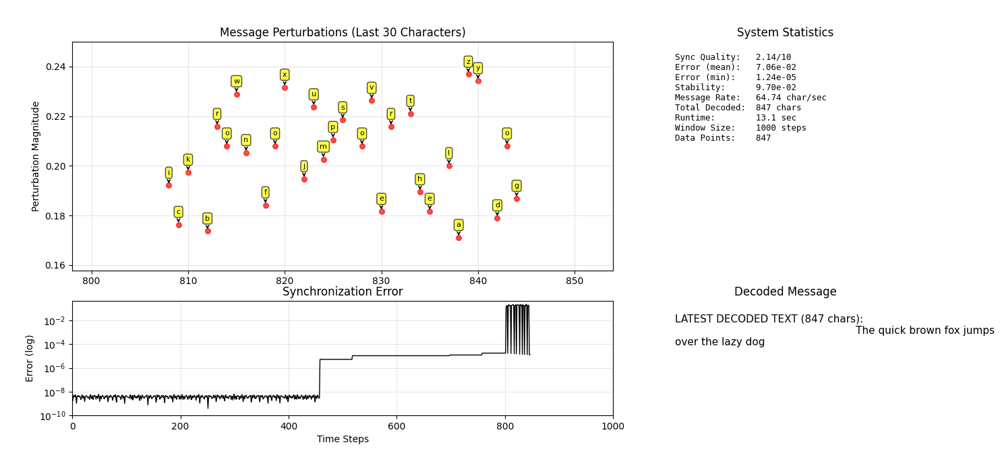

# Chaos-Based Secure Communication 

This repository contains the software implementation of our **Chaos-Based Secure Communication System**, developed as part of our ELEC 490 capstone project. The goal is to demonstrate the feasibility of secure message transmission using chaotic synchronization, specifically leveraging the **Lorenz attractor** and **Lyapunov stability theory**.

## Features
- **Chaotic Signal Generation**: Implements the Lorenz system of equations to produce secure, noise-like signals.
- **Synchronization**: Transmitter and receiver nodes synchronize via Lyapunov-based feedback control.
- **Character Encoding**: Messages are embedded as small perturbations in the chaotic state space.
- **Transmission Layer**: Communication occurs via UDP sockets, with adaptive synchronization to recover messages.
- **Real-Time Dashboard**: Visualization suite showing synchronization error, decoded messages, perturbations, and system statistics.

## Project Structure
- `lorenz.py` Defines the chaotic system dynamics.
- `encoder.py` / `decoder.py`Encode text into chaotic perturbations and recover them at the receiver.
- `communicator.py` UDP-based sender/receiver communication.
- `plotter.py` Real-time monitoring dashboard.
- `main_sender.py` / `main_receiver.py` Run transmitter and receiver nodes.

- 
